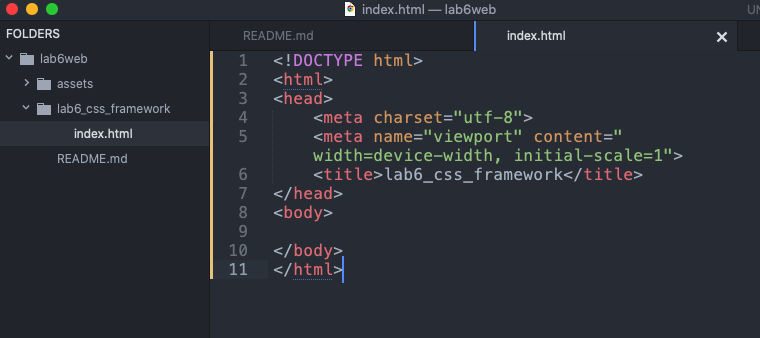
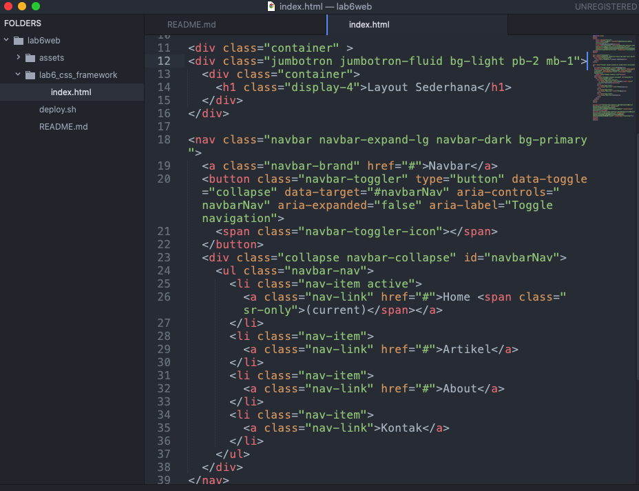
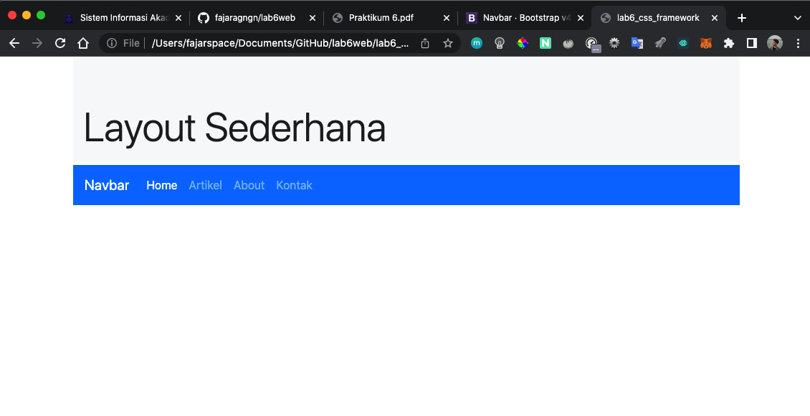
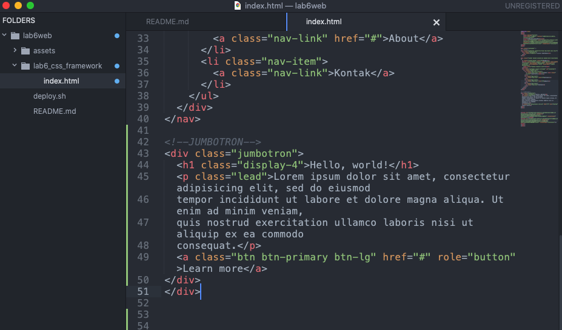
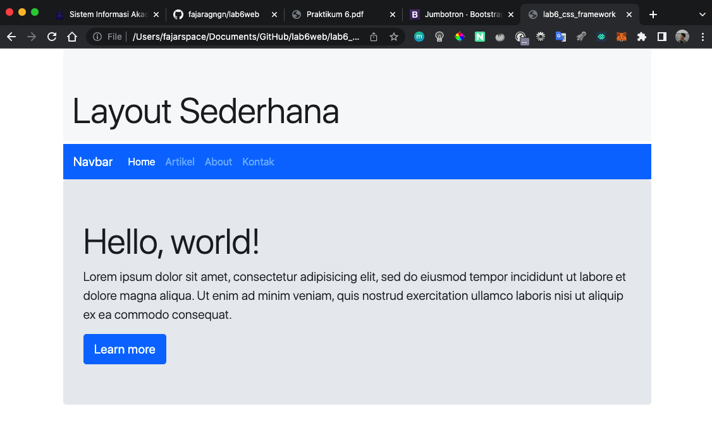

| Nama      | Fajar Agung Nugroho |
| ----------- | ----------- |
| NIM     | 312010448       |
| Kelas   | TI.20.A.1        |

## Langkah langkah praktikum 6

## 1. Buat folder baru dengan nama lab6_css_framework, Buat file baru dokumen html

## 2. Buatlah layout web sederhana menggunakan css frameword (Twitter Bootsrtap)

### 1. Quick start
Disini saya memakai Bootstrap 4. Copy atau download CSS & JS Bootstrap, Saya memilih copy

### 2. Navbar

### 3. Jumbotron

