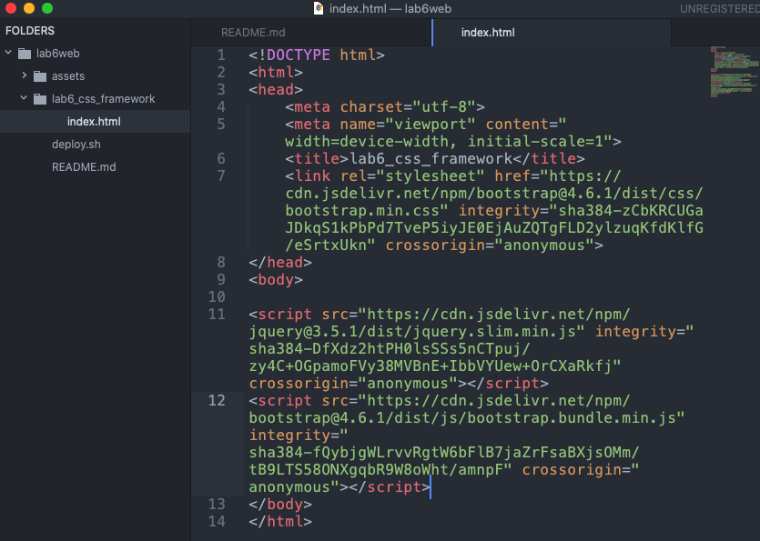
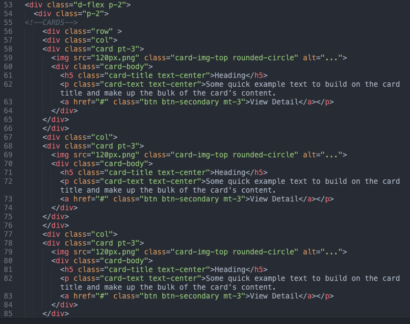

| Nama      | Fajar Agung Nugroho |
| ----------- | ----------- |
| NIM     | 312010448       |
| Kelas   | TI.20.A.1        |

## Langkah langkah praktikum 6

## 1. Buat folder baru dengan nama lab6_css_framework, Buat file baru dokumen html

## 2. Buatlah layout web sederhana menggunakan css frameword (Twitter Bootsrtap)

### 1. Quick start
Buka web https://getbootstrap.com Disini saya memakai Bootstrap 4. Copy atau download CSS & JS Bootstrap, Saya memilih copy

### 2. Navbar
Buat komponen website yang berupa menu. yang biasanya diletakkan pada header website.

Untuk mencari component klik menu documentation pada web bootstrap

### 3. Jumbotron
Selanjutnya buat jumbotron atau area besar pada Bootstrap, umumnya digunakan untuk menampilkan sebuah infromasi penting.

### 4. Cards
Untuk membuat pilihan konten sesuai dengan contoh, saya menggunakan cards

Penjelasan :

`col` memberi style sebuah table berdasarkan kolom tertentu 

`img-rounded-circle` untuk membuat border pada gambar menjadi bulat

`pt-3` padding top = 3

`mt-3` margin top = 3

